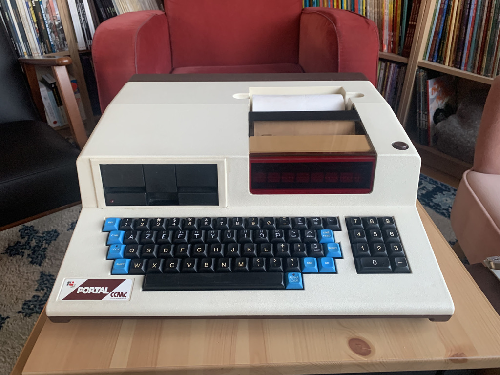
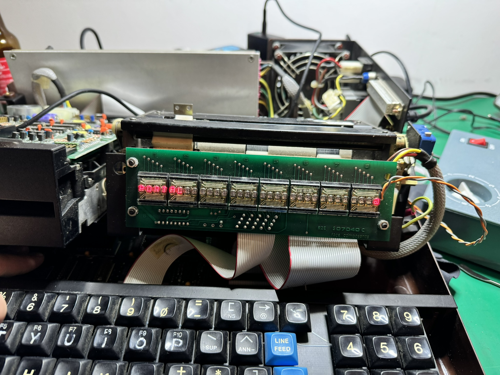

# Micral R2E Portal CCMC

Why spend valuable time on a weird French luggable computer designed for accountants?

Excellent question! Well, I have bought one, and it doesn't work, so it is important to understand its details to restore the machine is an good state.

Also, I intend to write code for the portal (like a debug ROM) and interoperate with it, so understanding its hardware is a must.

## Structure

* [debug](debug): Custom debug ROM
* [disks](disks): Floppy disk dumps
* [docs](docs): Some marketing documents, datasheets and reverse-engineering.
  * [filesystem](docs/filesystem.md): Anatomy of the floppy disks & Prologue filesystem
  * [findings](docs/findings.md): Software reverse-engineering and some history
  * [hardware](docs/hardware.md): Hardware specs, details and datasheets
  * [machines](docs/machines.md): List of known machines and their revisions
* [images](images): Pictures
* [roms](roms): ROM dumps and disassembly
* [software](software): Extracted software

## Pictures

